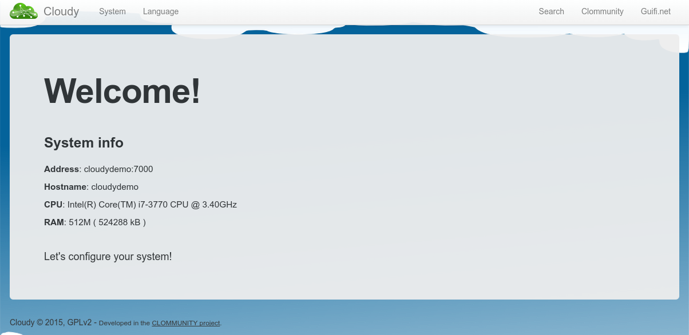
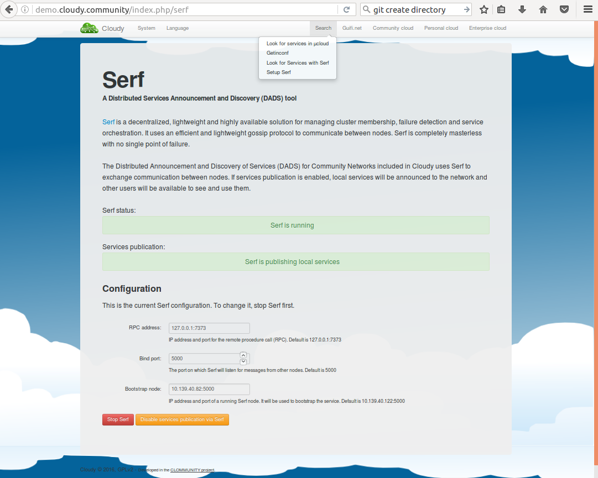
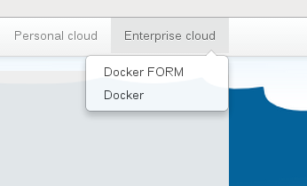

# Installing Cloudy in Debian

The script `cloudynitzar.sh` should be run to convert a Debian host into a Commnunity Networking cloud in a box.

Cloudynitzar is a shell script that turns your plain Debian system into a community networking cloud in a box (i.e. a full-featured Cloudy device). It might work on Debian derivatives too, like Ubuntu. 

`cloudynitzar.sh` is maintained at https://github.com/Clommunity/cloudynitzar

### Requirements
A system with an up-to-date Debian 8 *Jessie* installation with `curl`, `lsb-release` and an Internet connection.

### Procedure
From your Debian system run, as root:

```sh
apt-get update; apt-get install -y curl lsb-release
curl -k https://raw.githubusercontent.com/Clommunity/cloudynitzar/master/cloudynitzar.sh | bash -
```

### First steps after installation

To access the web management interface you have to open your browser and type the address of the Cloudy machine in the port 7000.

http://ADDRESS:7000

Credentials:

    User: <your root user>
    Password: <your password>

After successful login the following screen appears:



### Serf configuration

Serf should be activated in your Cloudy instance order to interconnect with other Cloudy nodes.

In the bootstrap node field introduce the IP and port of a running Serf agent.



### Docker installation

Open to the *Enterprise cloud* menu and by clicking on *Docker* you will install the Docker daemon.




